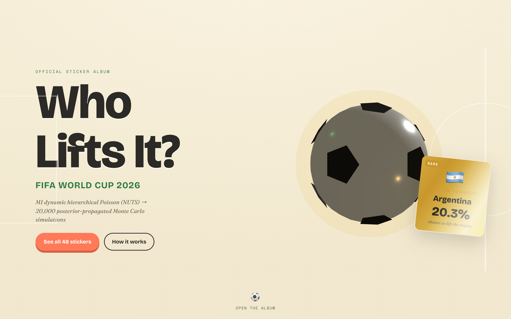
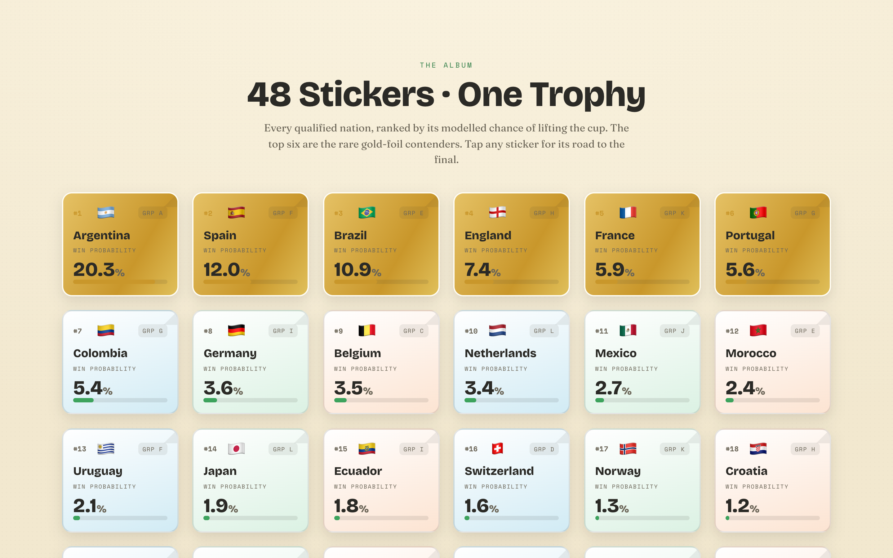
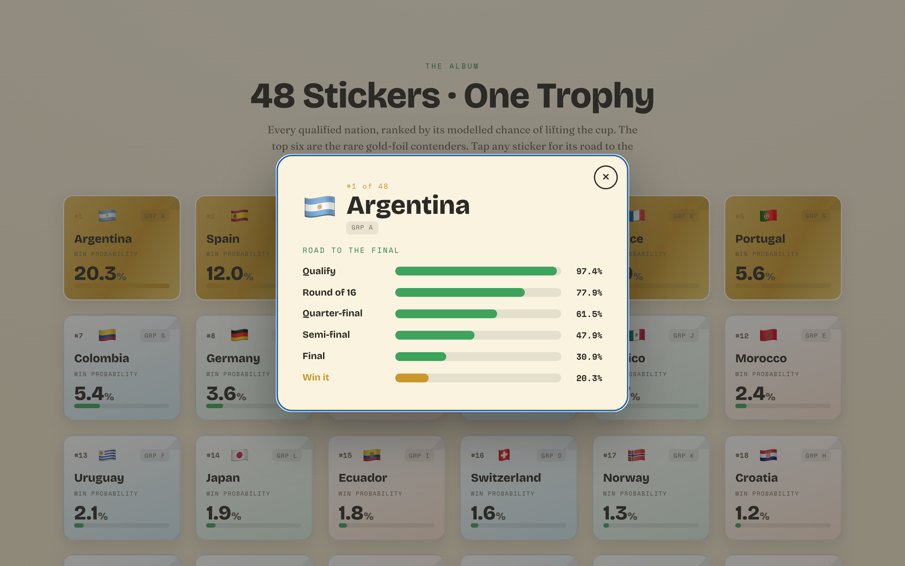
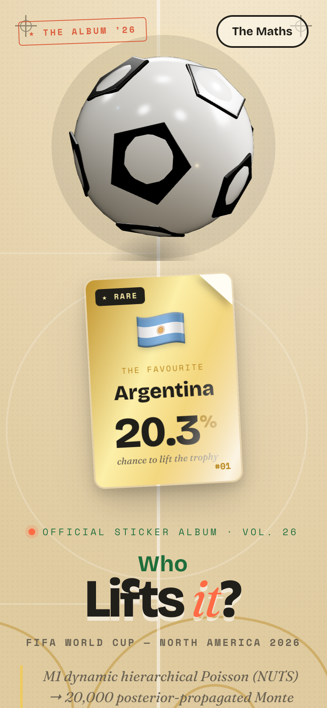

# ⚽ World Cup 2026 Predictor

**A PhD-grade machine-learning pipeline that predicts the FIFA World Cup 2026 — from 150 years of match results to one probability per team — wrapped in a playful sticker-album dashboard.**

It does not claim to *know* the winner. A single-elimination tournament is high variance: the model's job is a **calibrated, uncertainty-aware** probability spread across the contenders, not a crystal ball.



---

## 🏆 The headline (as of 2026-06-13)

Win probabilities from **20,000 posterior-propagated Monte Carlo simulations** of the real 48-team bracket:

| # | Team | P(win) | P(final) | P(reach SF) |
|---|------|-------:|---------:|------------:|
| 1 | 🇦🇷 Argentina | **20.3%** | 30.9% | 47.9% |
| 2 | 🇪🇸 Spain | 12.0% | 20.7% | 31.3% |
| 3 | 🇧🇷 Brazil | 10.9% | 17.8% | 28.7% |
| 4 | 🏴 England | 7.4% | 13.9% | 23.6% |
| 5 | 🇫🇷 France | 5.9% | 11.9% | 23.8% |
| 6 | 🇵🇹 Portugal | 5.6% | 11.1% | 20.1% |
| 7 | 🇨🇴 Colombia | 5.4% | 10.4% | 19.2% |

> **Read it honestly:** a ~1-in-5 favourite means ~4-in-5 *against*. The story is the spread across ~10 credible contenders — not a single pick. (Full 48-team table: [`docs/results/phase3-2026-prediction.md`](docs/results/phase3-2026-prediction.md).)

---

## 🧮 How it works

```
Data (1872–2026) → Elo + features → [ Bayesian Poisson · Gradient Boosting · Market Odds ]
                 → Meta-learner → Monte Carlo tournament simulation → win probabilities
```

The full mathematics — every equation — is its own typeset page: **[`web/math.html`](web/math.html)** (run the dashboard, then click *The Maths*). In brief:

1. **Elo** — a self-computed, importance- and margin-weighted rating from raw results (reproducible, no scraped feed).
2. **M1 — dynamic hierarchical bivariate Poisson** *(the flagship)*. Latent team **attack/defense** strengths that evolve as a Gaussian random walk across yearly periods (state-space), with a **Dixon–Coles** low-score correction and **hierarchical partial pooling**. Posterior sampled via **NUTS** (PyMC).
3. **M2** — a calibrated gradient-boosting classifier on engineered features.
4. **M3** — de-vigged bookmaker implied probabilities (benchmark).
5. **Meta-learner** — multinomial-logistic **stacking** of the base models, trained walk-forward (no leakage).
6. **Monte Carlo** — for each of 20,000 sims, draw **one** posterior sample of every team's strength and play the **entire** tournament under it. One draw governs all of a team's matches → outcomes are **correlated**, capturing tail behaviour naive per-match sampling misses.

### Does it actually work? (walk-forward backtest, WC 2010–2022)

| model | mean RPS ↓ |
|-------|-----------:|
| **meta-learner** | **0.1999** ✅ |
| Elo-logistic baseline | 0.2022 |
| gradient boosting | 0.2047 |
| Bayesian Poisson (M1) | 0.2064 |

The stacked meta-learner beats the Elo baseline on 3 of 4 tournaments (Ranked Probability Score, lower is better). The edge is small and honestly reported — international results are dominated by a roughly-linear strength signal that is hard to beat; M1's value is calibration + the posterior the simulator needs. ([details](docs/results/phase2-backtest.md))

---

## 📸 The dashboard — "THE ALBUM '26"

A light, playful World Cup **sticker-album** (three.js + GSAP). Spin the foil ball, scroll the 48 stickers in, click one for its road to the final.

| The Album (48 ranked stickers) | A team's road to the final |
|---|---|
|  |  |

Mobile 
---
  

---

## 🚀 Quickstart

### The dashboard (no Python needed — uses the committed prediction JSON)

```bash
cd web
python3 -m http.server 8099
# open http://localhost:8099/
```

### The model (reproduce the prediction)

Requires **Python 3.11+**.

```bash
python3.12 -m venv .venv && source .venv/bin/activate
pip install -e ".[dev]"

# 1. fetch the dataset (free; ~50k international matches, 1872–2026)
python -c "from wc2026.data.fetch import download_results; download_results('data/raw/results.csv')"

# 2. run the test suite
pytest -q -m "not slow"

# 3. baselines + GBM backtest on past World Cups
python scripts/full_backtest.py data/raw/results.csv

# 4. the headline: fit M1 (NUTS) + simulate 2026 → win probabilities
python scripts/predict_2026.py data/raw/results.csv

# 5. regenerate the dashboard's data
python -m scripts.export_web_data
```

---

## 📂 Repository structure

```
src/wc2026/
  data/        loaders, fetch, optional FIFA-ranking join
  elo/         self-computed Elo engine
  features/    point-in-time feature builder (leakage-guarded)
  models/      m1_poisson (PyMC) · gbm · odds · meta · baselines · dixon_coles
  eval/        scoring (RPS/Brier/log-loss) · calibration/ECE · backtest harness
  sim/         bracket · match sampler · group stage · knockout · Monte Carlo
scripts/       full_backtest.py · predict_2026.py · export_web_data.py
web/           the static dashboard (index.html + math.html, three.js + GSAP)
docs/          design specs, build plans, results, screenshots
tests/         TDD throughout
```

---

## ⚠️ Honest limitations

- **Tournament variance dominates.** Even a perfect model gives the favourite only ~20%.
- **The 48-team format has no precedent** — the *match* model trains on history; the *bracket* logic is encoded from FIFA's published 2026 rules, not learned.
- **Two documented approximations** (small effect on title odds): group tiebreakers beyond goal difference/goals-for use a random draw; the 8 best third-placed teams fill Round-of-32 slots by a fixed rule rather than FIFA's exact combination table.
- Calibrated and uncertainty-aware — **not** a market-beating oracle.

## 🛠️ Tech

Python · pandas · NumPy · scikit-learn · **PyMC** (NUTS) · arviz · pytest · three.js · GSAP · KaTeX. No build step for the site.

## 🙏 Data

International results from the [martj42/international_results](https://github.com/martj42/international_results) dataset.

## 📜 License

MIT — see [LICENSE](LICENSE).

---

*A personal modelling project. Not affiliated with FIFA or Panini. Predictions are probabilistic and for fun.*
